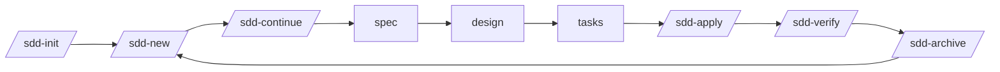

# Spec-Driven Development

**SDD** is a lightweight workflow for building software with specification files and [Claude Code](https://claude.ai/code) skills. It keeps your intent, decisions, and progress in plain Markdown files that live alongside your code.

---

## The problem

As a codebase grows, the gap between what you *intended* to build and what was *actually* built widens. Design decisions get lost in Slack threads. Architectural rationale disappears from commit history. Onboarding a new contributor (or returning to a project after a month) means archaeology.

SDD closes that gap with a structured directory — `openspec/` — that holds the living documentation of your project: specs, decisions, tasks, and a complete archive of every change ever made.

---

## Two tools, one workflow

SDD is made of two independent pieces that work together:

### Claude Code Skills

A set of `/sdd-*` slash commands for [Claude Code](https://claude.ai/code) that guide you through the SDD workflow:

```
/sdd-init     Bootstrap openspec/ in your project
/sdd-new      Start a new change: explore → propose
/sdd-apply    Implement change task by task
/sdd-verify   Run quality gates before merging
/sdd-archive  Close the change and update canonical specs
```

Skills work in any project — Python, TypeScript, PHP, Go — because they operate on `openspec/` files, not on your source code directly.

### sdd-tui

A terminal UI that visualizes the state of your `openspec/` in real time. Browse changes, inspect pipelines, read diffs, view specs, and navigate the decisions timeline — without leaving the terminal.

```bash
sdd-tui          # run from any directory containing openspec/
```

---

## How it looks

```
┌─ Changes ──────────────────────────────────────────────────────┐
│ NAME                   PHASE     STATUS    SIZE  HINT          │
│ ─────────────────────────────────────────────────────────────  │
│ auth-refresh-token     apply     ●  3/5    M     Run T04       │
│ user-profile-ui        verify    ✓  done   S     Push to CI    │
│ payment-webhook        propose   ○  new    ?     Write spec    │
└────────────────────────────────────────────────────────────────┘
```

---

## Quick start

```bash
# Install sdd-tui and the SDD skills
brew tap jorgeferrando/sdd-tui
brew install sdd-tui
sdd-setup

# Bootstrap openspec/ in your project
# (run /sdd-init in Claude Code)
cd your-project
sdd-tui
```

→ [Full install guide](getting-started/install.md)
→ [Walk through your first change](getting-started/first-change.md)

---

## Core idea

Each change follows a fixed cycle:



Every phase produces a Markdown artifact. Every artifact is reviewable, diffable, and searchable. When a change is archived, its specs merge into the canonical `openspec/specs/` — the single source of truth for your project's behavior.

→ [Workflow overview](workflow/overview.md)
