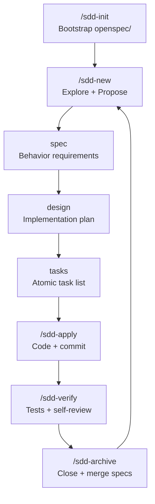

# Workflow Overview

The SDD workflow is a fixed cycle of phases. Each phase produces one Markdown artifact. The skills enforce the order and make sure nothing is skipped.

---

## The cycle



`/sdd-continue` acts as a smart router: it detects which phase is pending and runs the right skill automatically. You don't have to remember where you left off.

---

## Skills reference

| Skill | When to use | Reads | Produces |
|-------|-------------|-------|----------|
| [`/sdd-init`](sdd-init.md) | Once per project | Nothing | `openspec/` scaffold + steering files |
| [`/sdd-new`](sdd-new.md) | Starting a change | Codebase, existing specs | `proposal.md` |
| [`/sdd-continue`](sdd-continue.md) | After any phase | `tasks.md` state | Runs next pending skill |
| [`/sdd-ff`](sdd-ff.md) | When scope is clear | `proposal.md` | spec + design + tasks in one pass |
| [`/sdd-apply`](sdd-apply.md) | Implementing | `tasks.md` | Code commits, one per task |
| [`/sdd-verify`](sdd-verify.md) | Before merging | Test results, tasks | Quality gate report |
| [`/sdd-archive`](sdd-archive.md) | After verify | Change directory | Archived change + updated canonical specs |
| [`/sdd-steer`](sdd-steer.md) | When project evolves | Codebase | Updated steering files |

---

## Artifacts

Each phase leaves a file in `openspec/changes/{change-name}/`:

```
openspec/changes/my-change/
├── proposal.md     ← /sdd-new
├── specs/
│   └── auth/
│       └── spec.md ← /sdd-spec (via sdd-continue)
├── design.md       ← /sdd-design
└── tasks.md        ← /sdd-tasks
```

After archive:

```
openspec/
├── specs/
│   └── auth/
│       └── spec.md ← canonical (merged from change delta)
└── changes/
    └── archive/
        └── 2024-03-11-my-change/
            └── ...  ← permanent history
```

---

## One rule: one task, one file, one commit

The atomic commit discipline is what makes `sdd-apply` reviewable and `sdd-archive` meaningful. Each commit in the log corresponds to exactly one task in `tasks.md`. If something goes wrong, you can `git reset HEAD~1` and the task clearly maps back to what needs to be redone.

---

## When to use `/sdd-ff`

If the proposal is simple and you're confident about the design, skip the step-by-step and generate everything at once:

```
/sdd-ff "add export to CSV feature"
```

This runs propose → spec → design → tasks without pausing between phases. You still review and approve the output before `/sdd-apply`.

---

## When NOT to run the full ceremony

See [When not to use SDD →](../best-practices/when-not-to-use-sdd.md)
