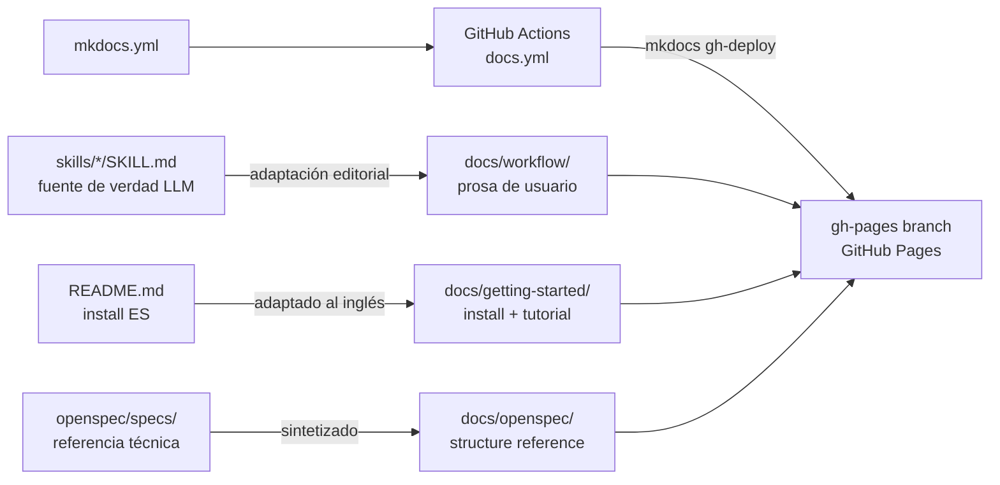

# Design: docs-site

## Metadata
- **Change:** docs-site
- **Proyecto:** sdd-tui
- **Fecha:** 2026-03-11
- **Estado:** approved

## Resumen Técnico

El site es puro Markdown + MkDocs Material. No hay código Python ni lógica de generación — solo contenido estático servido por GitHub Pages. La pipeline es mínima: `mkdocs gh-deploy` en un workflow de GitHub Actions que se activa solo cuando cambian ficheros bajo `docs/` o `mkdocs.yml`.

El contenido de cada skill se escribe como prosa de usuario (propósito, cuándo usarlo, input/output, ejemplo) — no se copian los SKILL.md raw, que están escritos como instrucciones para LLM. La fuente de verdad de los skills sigue siendo `skills/*/SKILL.md`; la doc es una adaptación editorial independiente.

## Arquitectura

## Archivos a Crear

### Infraestructura (3 archivos)

| Archivo | Tipo | Propósito |
|---------|------|-----------|
| `mkdocs.yml` | Config | Theme Material, nav, Mermaid, repo URL |
| `.github/workflows/docs.yml` | CI | Deploy automático a gh-pages en push a main |
| `docs/` | Directorio raíz | Contenido del site |

### Contenido — Getting Started (2 archivos)

| Archivo | Propósito |
|---------|-----------|
| `docs/index.md` | Hero: qué es SDD, problema que resuelve, dos herramientas (skills + TUI) |
| `docs/getting-started/install.md` | Install: brew / uv / curl / PowerShell + sdd-setup |
| `docs/getting-started/first-change.md` | Tutorial end-to-end con proyecto ficticio |

### Contenido — Workflow / Skills (9 archivos)

| Archivo | Skill documentada |
|---------|------------------|
| `docs/workflow/overview.md` | Diagrama Mermaid ciclo completo + tabla de skills |
| `docs/workflow/sdd-init.md` | Bootstrap + onboarding |
| `docs/workflow/sdd-new.md` | explore + propose |
| `docs/workflow/sdd-ff.md` | Fast-forward |
| `docs/workflow/sdd-apply.md` | Implementación tarea a tarea |
| `docs/workflow/sdd-verify.md` | Quality gates |
| `docs/workflow/sdd-archive.md` | Cierre del change |
| `docs/workflow/sdd-continue.md` | Router de fase pendiente |
| `docs/workflow/sdd-steer.md` | Steering artifacts |

### Contenido — openspec Reference (4 archivos)

| Archivo | Propósito |
|---------|-----------|
| `docs/openspec/structure.md` | Anatomía del directorio, cada fichero y por qué existe |
| `docs/openspec/steering.md` | Qué son los steering files, cuándo actualizarlos |
| `docs/openspec/milestones.md` | milestones.yaml + todos/ |
| `docs/openspec/providers.md` | GitWorkflowConfig, GitHub provider, null provider |

### Contenido — TUI Reference (3 archivos)

| Archivo | Propósito |
|---------|-----------|
| `docs/tui/overview.md` | Qué hace el TUI, cuándo usarlo vs solo skills |
| `docs/tui/keybindings.md` | Todas las vistas con tabla de teclas |
| `docs/tui/views.md` | Descripción de cada pantalla (View 1..9 + screens) |

### Contenido — Best Practices (3 archivos)

| Archivo | Propósito |
|---------|-----------|
| `docs/best-practices/scope-control.md` | Cuándo dividir un change, regla de los 20 ficheros |
| `docs/best-practices/atomic-commits.md` | One task = one file = one commit |
| `docs/best-practices/when-not-to-use-sdd.md` | Hotfixes, config, patches menores |

## Archivos a Modificar

| Archivo | Cambio | Motivo |
|---------|--------|--------|
| `pyproject.toml` | Añadir `[project.optional-dependencies] docs = ["mkdocs-material>=9.0"]` | REQ-14: deps aisladas del main install |

## Scope

- **Total archivos:** 22 nuevos + 1 modificado = **23 archivos**
- **Resultado:** ⚠️ Supera límite de 20

### Decisión de split

Los 23 archivos son Markdown de contenido (sin código, sin lógica). La complejidad de revisión por archivo es baja comparada con código. Se propone un split por completitud funcional:

| Change | Archivos | Deploy funcional |
|--------|----------|-----------------|
| `docs-site` (este) | infra (mkdocs.yml, CI) + index + getting-started + workflow (9 skills) = **15 archivos** | Sí — site desplegado con sección principal completa |
| `docs-site-content` | openspec ref (4) + TUI ref (3) + best practices (3) = **10 archivos** | Sí — añade las 3 secciones restantes |

**Total:** 15 + 10 = 25 archivos en 2 PRs.

> Si el usuario prefiere un único PR dada la naturaleza Markdown, también es aceptable — sin riesgo de regresión en código.

## Dependencias Técnicas

- Sin dependencias de otros changes
- Requiere activar GitHub Pages en el repo (Settings → Pages → branch: `gh-pages`) — acción manual una vez
- Python no requerido para el contenido — solo para `mkdocs serve` local

## Patrones Aplicados

- **Static site generation:** MkDocs Material — patrón estándar para proyectos Python open source
- **Editorial separation:** skills/*/SKILL.md (instrucciones LLM) → docs/ (prosa usuario) — no auto-sync intencional
- **Path-filtered CI:** workflow solo se activa en cambios a `docs/**` o `mkdocs.yml`, no en cada push de código

## Decisiones de Diseño

| Decisión | Alternativa | Motivo |
|---------|------------|--------|
| Split en 2 changes | Un único PR de 23 ficheros | Respetar límite de 20; cada PR tiene valor autónomo |
| `[project.optional-dependencies]` en pyproject.toml | `[dependency-groups] docs` | `optional-dependencies` es PEP 508 estándar; más compatible con `pip install sdd-tui[docs]` |
| Trigger CI solo en paths `docs/**` + `mkdocs.yml` | En cada push a main | Evita deploys innecesarios cuando cambia código Python |
| No incluir `sdd-audit` y `sdd-spec` en Workflow section | Incluirlas todas | Las 8 core (init/new/ff/apply/verify/archive/continue/steer) son el flujo principal; audit y spec son auxiliares — se pueden añadir en `docs-site-content` |

## Notas de Implementación

- `mkdocs.yml`: usar `pymdownx.superfences` con custom fence para Mermaid; activar `navigation.tabs` de Material para las 5 secciones principales
- GitHub Actions: usar `actions/setup-python@v5` + `pip install mkdocs-material` (sin cachear en v1 — se puede añadir después)
- El tutorial `first-change.md` debe usar un proyecto ficticio coherente (p.ej. "a task manager CLI") que aparezca en todos los ejemplos de skills
- `docs/index.md`: no usar H1 "SDD" — mkdocs.yml define `site_name`; empezar directamente con el hook (problema → solución)
