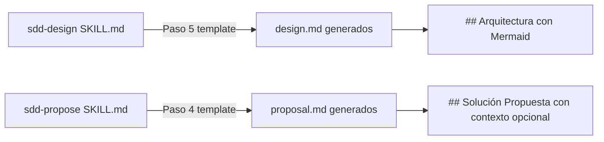
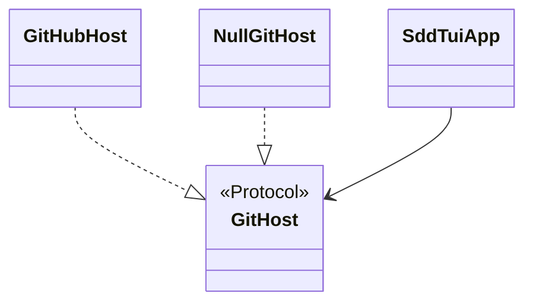

# Design: Convención de diagramas Mermaid en SDD docs

## Metadata
- **Change:** mermaid-diagrams
- **Jira:** N/A
- **Proyecto:** sdd-tui (skills ~/.claude/skills/)
- **Fecha:** 2026-03-11
- **Estado:** draft

## Resumen Técnico

Dos ediciones quirúrgicas en SKILL.md files. En `sdd-design`, se reemplaza la
indicación genérica "Diagrama ASCII o descripción del flujo" por una regla
concreta con tipos Mermaid según situación. En `sdd-propose`, se añade una nota
opcional de diagrama de contexto en el template de `proposal.md`.

No se crea ningún archivo nuevo. No hay código ejecutable. Sin tests.

## Arquitectura



## Archivos a Modificar

| Archivo | Sección | Cambio |
|---------|---------|--------|
| `~/.claude/skills/sdd-design/SKILL.md` | Paso 5 — template `## Arquitectura` | Reemplazar "Diagrama ASCII o descripción del flujo" por guía Mermaid con regla ≥3 componentes y tabla de tipos |
| `~/.claude/skills/sdd-propose/SKILL.md` | Paso 4 — template `## Solución Propuesta` | Añadir nota: diagrama `flowchart LR` opcional para scopes multi-actor |

## Scope

- **Total archivos:** 2
- **Resultado:** Ideal

## Diseño detallado — sdd-design/SKILL.md

Sección `## Arquitectura` del template (actualmente línea ~122):

**Antes:**
```markdown
## Arquitectura

{Diagrama ASCII o descripción del flujo}

```
Request → Controller → Handler → Repository → DB
                    ↓
              Domain Entity
```
```

**Después:**
```markdown
## Arquitectura

{Diagrama Mermaid (obligatorio si ≥3 componentes relacionados, opcional si < 3)}

Tipos por situación:
- `classDiagram` → módulos, clases, Protocols, herencia, composición
- `sequenceDiagram` → flujos temporales: wizard steps, async workers, peticiones
- `flowchart LR` → navegación de screens, contexto del sistema, dependencias
- `stateDiagram-v2` → ciclo de vida, estados de pipeline

Ejemplo (classDiagram):

```

## Diseño detallado — sdd-propose/SKILL.md

En el template de `proposal.md`, sección `## Solución Propuesta` (Paso 4):

**Antes:**
```markdown
## Solución Propuesta

{Descripción de alto nivel del approach. Sin entrar en detalles técnicos todavía.}
```

**Después:**
```markdown
## Solución Propuesta

{Descripción de alto nivel del approach. Sin entrar en detalles técnicos todavía.}

{Opcional — diagrama de contexto `flowchart LR` si hay ≥2 sistemas/actores externos
interactuando. Omitir si el scope es interno a un solo módulo.}
```

## Decisiones de Diseño

| Decisión | Alternativa | Motivo |
|---------|------------|--------|
| Mermaid en lugar de ASCII art | ASCII art manual | Mermaid renderiza en GitHub, sintaxis mantenible, Claude lo genera bien |
| Integrar en skills existentes | Skill `sdd-diagram` nueva | Las skills son prompt-only; no requiere tool use separado |
| Diagrama en proposal.md es opcional | Obligatorio siempre | Proposals simples (un módulo) no se benefician de diagramas |
| Regla "≥3 componentes" en design.md | Siempre obligatorio | Evita diagramas triviales para cambios de 1-2 archivos |

## Notas de Implementación

- La edición en `sdd-design` es en el bloque de texto del template (Paso 5),
  no en la lógica del skill
- El ejemplo incluido en el template usa `classDiagram` — el más frecuente en
  este proyecto (Protocols, dataclasses)
- No alterar la estructura ni el orden de secciones de ningún SKILL.md
