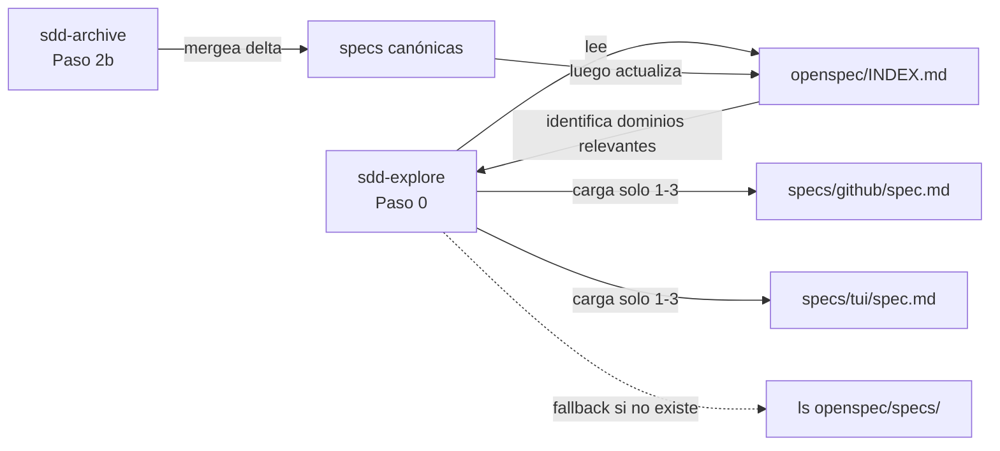

# Design: OpenSpec Index — Two-Level Lookup

## Metadata
- **Change:** openspec-index
- **Jira:** —
- **Proyecto:** sdd-tui (skills SDD + openspec)
- **Fecha:** 2026-03-11
- **Estado:** draft

## Resumen Técnico

Tres cambios coordinados: crear el archivo `openspec/INDEX.md` con las 8 entradas actuales,
actualizar `sdd-explore` para leerlo como primer paso, y actualizar `sdd-archive` para
mantenerlo al cerrar cada change.

No hay cambios en código Python ni en tests. Todo el trabajo es en archivos de skill
(Markdown) y en el propio `openspec/`.

## Arquitectura



## Archivos a Crear

| Archivo | Tipo | Propósito |
|---------|------|-----------|
| `openspec/INDEX.md` | Datos | Índice de los 8 dominios canónicos actuales |

## Archivos a Modificar

| Archivo | Cambio | Motivo |
|---------|--------|--------|
| `~/.claude/skills/sdd-explore/SKILL.md` | Añadir Paso 0: leer INDEX.md antes del Paso 4 | REQ-EXP-01/02/03 |
| `~/.claude/skills/sdd-archive/SKILL.md` | Añadir Paso 2b: actualizar INDEX.md tras merge de specs | REQ-ARC-01/02/03 |

## Scope

- **Total archivos:** 3 (1 crear, 2 modificar)
- **Resultado:** Ideal (< 10)

## Detalle de cambios

### T01 — `openspec/INDEX.md`

Formato por entrada:
```markdown
## {domain} (`specs/{domain}/spec.md`)
{Descripción 1-2 líneas}
**Entidades:** {Symbol1}, {function()}, ...
**Keywords:** {kw1}, {kw2}, ...
```

8 entradas: `core`, `tui`, `distribution`, `tooling`, `docs`, `tests`, `github`, `providers`.
Ordenadas por tamaño descendente (más grandes primero = más frecuentemente relevantes).

### T02 — `sdd-explore/SKILL.md` (Paso 0 nuevo)

Insertar **antes del Paso 1 actual** (o como primer sub-paso del Paso 4):

```markdown
## Paso 0: Leer OpenSpec Index

Si existe `openspec/INDEX.md`, leerlo primero:
- Identificar dominios relevantes por keywords del change/ticket
- Cargar solo los spec files de los 1-3 dominios identificados
- Si INDEX.md no existe → continuar con Paso 4 normal (ls openspec/specs/)
```

Ubicación exacta: nuevo bloque antes del "## Paso 1: Cargar Skills", o integrado en
el "## Paso 4: Explorar openspec/ existente" como primer punto.

**Decisión:** Integrarlo en Paso 4 (no renumerar los pasos existentes) — es
conceptualmente parte de "explorar openspec/", no un paso nuevo de lifecycle.

### T03 — `sdd-archive/SKILL.md` (Paso 2b nuevo)

Insertar entre Paso 2 y Paso 3:

```markdown
## Paso 2b: Actualizar openspec/INDEX.md

Si existe `openspec/INDEX.md`:
1. Para cada dominio modificado en este change, actualizar su entrada
2. Si el change añade un dominio nuevo, añadir entrada al índice
3. Si algún dominio en `openspec/specs/` no tiene entrada → advertir al usuario

Si `openspec/INDEX.md` no existe → no hacer nada (el índice es opcional).
```

## Dependencias Técnicas

- Sin dependencias externas
- Sin migraciones
- `openspec/` es local en este proyecto — en otros proyectos SDD, INDEX.md se crearía
  al archivar el primer change tras actualizar el skill

## Decisiones de Diseño

| Decisión | Alternativa | Motivo |
|---------|------------|--------|
| Integrar en Paso 4 de sdd-explore (no Paso 0) | Añadir como nuevo Paso 0 | No renumerar pasos existentes; conceptualmente correcto: INDEX.md es parte de "explorar openspec/" |
| Paso 2b en sdd-archive (no Paso 5b) | Al final del cierre | Debe ocurrir antes del move para que INDEX.md refleje el estado post-merge, no pre-merge |
| No modificar sdd-spec | Añadir Paso 0 en sdd-spec también | sdd-spec ya identifica el dominio desde proposal.md — el INDEX aportaría poco; YAGNI |

## Notas de Implementación

- Al crear INDEX.md, derivar las entidades y keywords leyendo cada spec canónica
- El orden de entradas en INDEX.md: por tamaño descendente (tui → core → distribution → ...)
  ya que los dominios más grandes son los que más frecuentemente necesitan ser identificados
- La nota de cabecera de INDEX.md debe ser explícita sobre el propósito y el flujo de uso
  para que Claude Code la entienda sin contexto adicional
