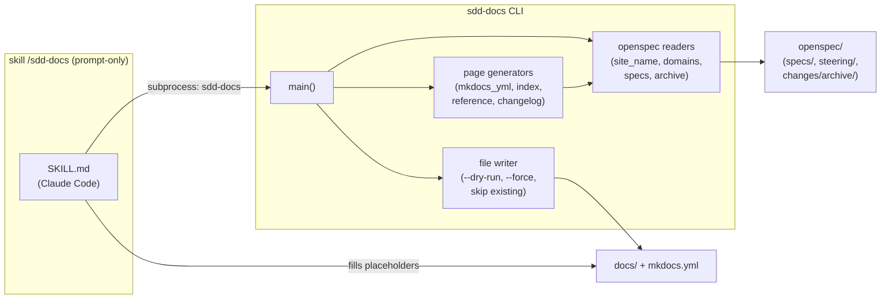

# Design: sdd-docs-generator

## Metadata
- **Change:** sdd-docs-generator
- **Proyecto:** sdd-tui
- **Fecha:** 2026-03-11
- **Estado:** draft

## Resumen Técnico

El change añade `sdd-docs`, un nuevo CLI entry point en el paquete `sdd_tui`.
Todo el código vive en `src/sdd_tui/docs_gen.py` — un módulo autocontenido siguiendo
el patrón de `setup.py`: funciones puras para cada operación, `main()` como entry point.

El módulo tiene tres responsabilidades:
1. **Lectura de openspec/**: extraer site name, descripción, dominios, requisitos, decisiones,
   changelog del archive.
2. **Generación de contenido**: producir strings Markdown para cada página + el YAML de mkdocs.
3. **Escritura controlada**: `--dry-run`, `--force`, skip de existentes, summary al final.

El skill `/sdd-docs` es prompt-only (`skills/sdd-docs/SKILL.md`) — no hay código Python
para él. Invoca `sdd-docs` via subprocess si el scaffold no existe, luego usa Claude para
rellenar placeholders.

## Arquitectura



## Archivos a Crear

| Archivo | Tipo | Propósito |
|---------|------|-----------|
| `src/sdd_tui/docs_gen.py` | Módulo Python | CLI entry point + toda la lógica de generación |
| `tests/test_docs_gen.py` | Tests | Cobertura unitaria con `tmp_path` |
| `skills/sdd-docs/SKILL.md` | Skill prompt | Capa inteligente: rellena placeholders con Claude |

## Archivos a Modificar

| Archivo | Cambio | Motivo |
|---------|--------|--------|
| `pyproject.toml` | Añadir `sdd-docs = "sdd_tui.docs_gen:main"` en `[project.scripts]` | Nuevo entry point |
| `Formula/sdd-tui.rb` | Añadir `system bin/"sdd-docs", "--help"` en el bloque `test` | REQ-DIST03 |

## Scope

- **Total archivos:** 5
- **Resultado:** Ideal (< 10)

## Estructura de `docs_gen.py`

```python
# Funciones de lectura
def find_openspec(start: Path) -> Path | None          # busca openspec/ hasta git root
def find_git_root(start: Path) -> Path | None          # git rev-parse --show-toplevel
def load_site_name(openspec: Path) -> str              # product.md H1 → config.yaml → dirname
def load_site_description(openspec: Path) -> str       # product.md primer párrafo → placeholder
def list_spec_domains(openspec: Path) -> list[str]     # ls openspec/specs/
def parse_spec_requirements(text: str) -> list[dict]   # extrae REQs EARS → [{id, type, desc}]
def parse_spec_decisions(text: str) -> list[dict]      # extrae tabla decisiones → [{dec, alt, why}]
def collect_archived_changes(archive: Path) -> list    # mismo patrón que changelog.py
def _extract_proposal_description(text: str) -> str    # primer párrafo de ## Descripción

# Funciones de generación de contenido (devuelven str)
def render_mkdocs_yml(site_name, description, domains, has_changelog) -> str
def render_index_md(site_name, description_src) -> str
def render_reference_page(domain: str, spec_path: Path) -> str
def render_changelog_md(archive: Path) -> str
def make_placeholder(type_: str, description: str) -> str

# Entry point
def main() -> None
```

## Dependencias Técnicas

- Sin dependencias nuevas en runtime — solo stdlib (`pathlib`, `argparse`, `re`, `subprocess`)
- `mkdocs-material` ya está en `[project.optional-dependencies]` — no se modifica
- No depende de otros módulos de `sdd_tui` (autocontenido como `setup.py`)

## Patrones Aplicados

- **Módulo autocontenido**: igual que `setup.py` — sin imports de `sdd_tui.core` para evitar
  acoplar la CLI a la TUI. Facilita testing y uso standalone.
- **Funciones puras**: todas las funciones de lectura y generación son puras (reciben Path,
  devuelven str/list). El side effect (escritura) solo ocurre en `main()`.
- **`tmp_path` fixture**: tests con `pytest` y `tmp_path` — sin mocks, filesystem real como
  en `test_changelog.py`.

## Decisiones de Diseño

| Decisión | Alternativa | Motivo |
|---------|------------|--------|
| Un solo módulo `docs_gen.py` | Paquete `docs_gen/` con submódulos | 300-400 líneas esperadas — no justifica paquete |
| Sin imports de `sdd_tui.core` | Reusar `core/spec_parser.py` | Independencia: `sdd-docs` debe funcionar sin la TUI instalada |
| `collect_archived_changes` propia | Importar de `scripts/changelog.py` | `scripts/` no es paquete Python importable; duplicar la función pequeña es correcto |
| No generar Getting Started / workflow pages | Generar todo el nav | Esas páginas son narrativas — requieren skill inteligente, no CLI |
| Skill como SKILL.md prompt-only | Script Python con llamadas API | Consistente con todos los demás skills SDD del proyecto |

## Tests Planificados

| Test | Qué verifica |
|------|-------------|
| `test_find_openspec_found` | Encuentra openspec/ desde subdirectorio |
| `test_find_openspec_not_found` | Retorna None si no hay openspec/ |
| `test_load_site_name_from_product_md` | Extrae H1 de product.md |
| `test_load_site_name_fallback_dirname` | Usa nombre del directorio si no hay product.md |
| `test_load_site_description_from_product_md` | Extrae primer párrafo |
| `test_load_site_description_placeholder` | Retorna placeholder si no hay steering |
| `test_list_spec_domains` | Lista dominios desde openspec/specs/ |
| `test_parse_spec_requirements` | Extrae REQs EARS con id, type, desc |
| `test_parse_spec_decisions` | Extrae tabla de decisiones |
| `test_collect_archived_changes` | Lee archive/, ordena newest-first |
| `test_render_mkdocs_yml_basic` | Genera YAML válido con nav mínimo |
| `test_render_mkdocs_yml_with_changelog` | Incluye changelog en nav cuando existe archive |
| `test_render_mkdocs_yml_without_changelog` | Omite changelog del nav si archive vacío |
| `test_render_index_md_with_steering` | Usa description de product.md |
| `test_render_index_md_placeholder` | Inserta placeholder si no hay steering |
| `test_render_reference_page` | Genera tabla REQs y tabla decisiones |
| `test_render_reference_page_no_decisions` | Omite tabla decisiones si no existe sección |
| `test_render_changelog_md` | Lista changes newest-first |
| `test_make_placeholder` | Formato correcto del HTML comment |
| `test_main_no_openspec` | Exit code 1 + mensaje claro |
| `test_main_generates_files` | Crea docs/index.md, mkdocs.yml, reference pages |
| `test_main_dry_run` | No escribe archivos, lista qué generaría |
| `test_main_no_force_skips_existing` | No sobreescribe sin --force |
| `test_main_force_overwrites` | Sobreescribe con --force |

## Notas de Implementación

- `find_openspec` sube directorio a directorio hasta encontrar `openspec/` o alcanzar el root
  del repo (via `git rev-parse`). Si git falla, sube hasta el filesystem root.
- `render_mkdocs_yml` genera el nav dinámicamente: siempre incluye `Home: index.md`,
  luego `Reference > {domain}: reference/{domain}.md` por cada dominio, y opcionalmente
  `Changelog: changelog.md` si hay archive entries.
- `parse_spec_requirements` busca líneas con patrón `**REQ-\w+**` y extrae el tipo EARS
  del bracket `[Event]`, `[Ubiquitous]`, etc.
- El skill `skills/sdd-docs/SKILL.md` debe documentar: cómo invocar `sdd-docs`, el formato
  de los placeholders, y las instrucciones para Claude de cómo rellenarlos leyendo steering.
