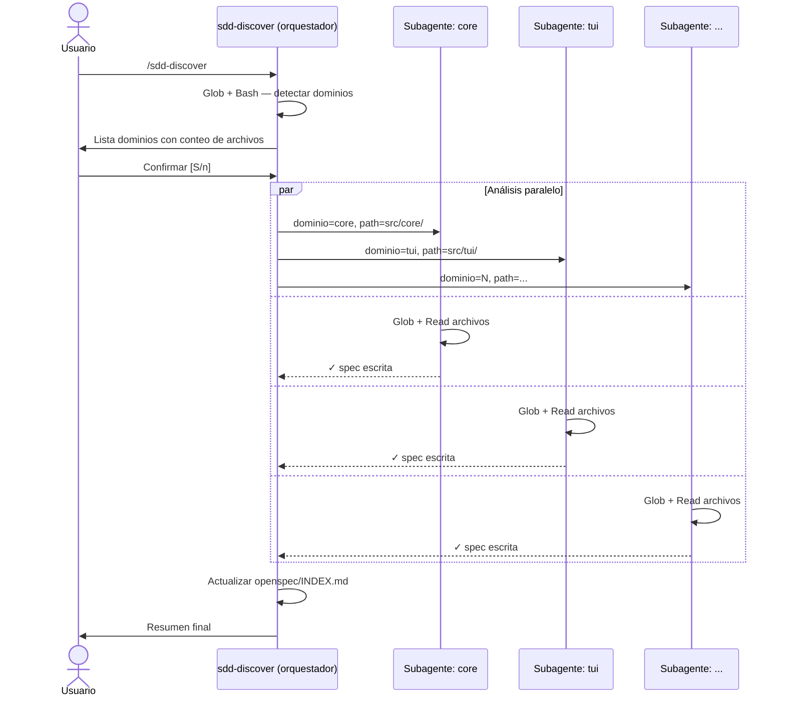

# Design: sdd-init-reverse-spec

## Metadata
- **Change:** sdd-init-reverse-spec
- **Proyecto:** sdd-tui (skills en `~/.claude/skills/`)
- **Fecha:** 2026-03-11
- **Estado:** draft

## Resumen Técnico

Cambio de skills únicamente — sin código Python nuevo. Dos modificaciones en paralelo:

1. `sdd-init/SKILL.md` recibe un bloque condicional al final del Paso 6 (resumen de estado): si `openspec/specs/` está vacío, añade una línea en "Próximos pasos" con el hint hacia `/sdd-discover`.

2. `sdd-discover/SKILL.md` es un skill nuevo con patrón de orquestador: detecta dominios con Glob/Bash, presenta un resumen interactivo al usuario, y lanza un subagente por dominio en paralelo (Agent tool). Cada subagente tiene contexto aislado, lee los archivos del dominio asignado y escribe su spec directamente en `openspec/specs/{dominio}/spec.md`. El orquestador recibe solo el estado de finalización (no el contenido completo), mantiene su contexto ligero, y cierra actualizando `openspec/INDEX.md`.

## Arquitectura



## Archivos a Crear

| Archivo | Tipo | Propósito |
|---------|------|-----------|
| `~/.claude/skills/sdd-discover/SKILL.md` | Skill (prompt) | Nuevo skill de reverse-spec |

## Archivos a Modificar

| Archivo | Cambio | Motivo |
|---------|--------|--------|
| `~/.claude/skills/sdd-init/SKILL.md` | Añadir hint condicional en Paso 6 | REQ-HINT-01/02/03 |
| `openspec/specs/tooling/spec.md` | Merge delta — añadir secciones 9 y 10 | Actualizar spec canónica a v5.2 |
| `openspec/INDEX.md` | Actualizar entrada `tooling` | Refleja nuevos skills documentados |

## Scope

- **Total archivos:** 4
- **Resultado:** Ideal (< 10)

## Estructura de sdd-discover/SKILL.md

```
# SDD Discover

## Usage
## Prerequisitos (sdd-init ejecutado)

## Paso 1: Detectar Dominios
  → Bash: find/ls para estructura de directorios
  → Glob: contar archivos fuente por dominio
  → Reglas de inferencia (src/, tests/, etc.)

## Paso 2: Resumen Interactivo
  → Mostrar lista con conteos
  → AskUserQuestion / pausa para confirmación

## Paso 3: Análisis por Dominio (Subagentes)
  → Agent tool por cada dominio detectado
  → Prompt del subagente: dominio + path + plantilla spec canónica
  → Subagente escribe openspec/specs/{dominio}/spec.md
  → Colectar status de retorno

## Paso 4: Actualizar INDEX.md
  → Si existe: añadir solo dominios nuevos
  → Si no existe: crear desde cero con todos los dominios

## Paso 5: Resumen Final
  → Lista de specs generados / omitidos
  → Hint: "Validar con /sdd-spec {dominio}"
```

## Patrones Aplicados

- **Orquestador + subagentes**: mismo patrón que usan los skills `review-prs` y `agent-explore` — el orquestador mantiene contexto mínimo delegando el trabajo pesado
- **Skills como prompt-only**: no hay código ejecutable — toda la lógica es instrucciones para Claude. Referencia directa a `sdd-steer`, `sdd-audit` (mismo modelo)
- **Hint condicional en init**: mismo patrón que `sdd-apply` Step 0 (verifica steering, si no existe → hint + stop)

## Decisiones de Diseño

| Decisión | Alternativa | Motivo |
|---------|------------|--------|
| Subagente por dominio con Agent tool | Loop secuencial en el mismo contexto | Contexto aislado por dominio; proyectos grandes no saturan el orquestador |
| Subagentes en paralelo | Secuencial | Dominios son independientes — no hay conflicto de escritura |
| Hint en "Próximos pasos" de sdd-init | Mensaje propio al final | Mantiene el formato existente del resumen; no rompe el flujo |
| Subagente recibe plantilla spec canónica | Subagente lee spec canónica por su cuenta | Garantiza formato correcto sin depender de que el subagente encuentre el ejemplo correcto |

## Notas de Implementación

**sdd-discover Paso 1 — inferencia de dominios:**
- `src/` o `app/` como raíz → cada subdirectorio directo es un dominio candidato
- Archivos `.py/.ts/.php/.rb/.go/.rs/.java` en la raíz → dominio `root` o nombre del proyecto
- `tests/`, `spec/`, `__tests__/`, `test/` → dominio `tests` (unificado)
- Directorios a ignorar: `node_modules/`, `vendor/`, `.git/`, `dist/`, `build/`, `__pycache__/`

**Prompt del subagente (plantilla):**
El orquestador pasa al subagente:
1. Nombre del dominio
2. Path del directorio
3. El formato canónico de spec (secciones requeridas + `Status: inferred`)
4. Instrucción: leer archivos necesarios → escribir spec → retornar "done"

**sdd-init hint — condición exacta:**
```bash
# Verificar si openspec/specs/ tiene algún spec.md
find openspec/specs -name "spec.md" | head -1
# Si vacío → mostrar hint
```
